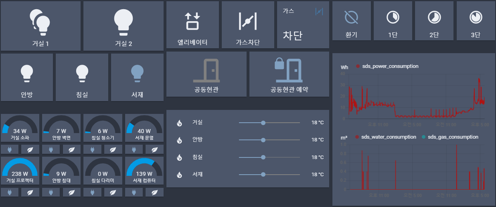
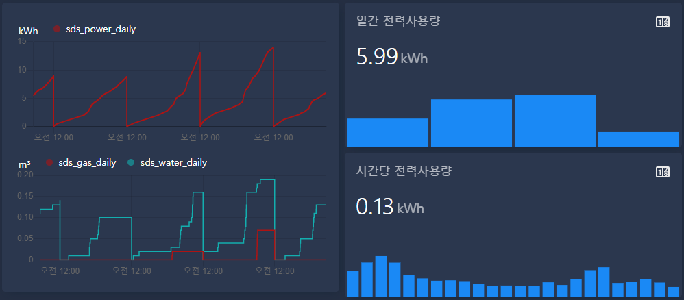

# Lovelace 구성 예제 코드



## 적용 방법

### 카드 추가
* 카드 종류 목록 맨 밑의 "직접 작성" 을 누른 후, 카드 코드를 붙여넣으시면 됩니다.

### YAML 추가
* 먼저 configuration.yaml 에 아래 내용이 없다면 추가해주세요.
```yaml
homeassistant:
  packages: !include_dir_named packages
```
* 이후 yaml 파일을 다운받아서, configuration.yaml 파일이 있는 경로에 packages 폴더를 만들고 집어넣으시면 됩니다.
* HA 재시작이 필요합니다.

## 장치

### 조명

* 버튼의 개수는 집 환경에 맞추어 설정하시면 됩니다.
* 예제로만 참고하시고 조명은 그냥 버튼 카드를 직접 만드시는게 더 빠릅니다.

<details markdown="1">
<summary>Lovelace 카드</summary>

```yaml
cards:
  - cards:
      - entity: light.sds_light_1
        hold_action:
          action: more-info
        icon: 'mdi:lightbulb-multiple'
        icon_height: 100px
        name: 거실 1
        tap_action:
          action: toggle
        type: button
      - entity: light.sds_light_2
        hold_action:
          action: more-info
        icon_height: 100px
        name: 거실 2
        tap_action:
          action: toggle
        type: button
    type: horizontal-stack
  - cards:
      - entity: light.sds_light_3
        hold_action:
          action: more-info
        icon_height: 100px
        name: 안방
        tap_action:
          action: toggle
        type: button
      - entity: light.sds_light_4
        hold_action:
          action: more-info
        icon_height: 100px
        name: 침실
        tap_action:
          action: toggle
        type: button
      - entity: light.sds_light_5
        hold_action:
          action: more-info
        icon_height: 100px
        name: 서재
        tap_action:
          action: toggle
        type: button
    type: horizontal-stack
type: vertical-stack
```
</details>

### 대기전력차단 플러그

* 대기전력 차단 기능이 꺼진 상태에서는, 플러그가 꺼지지 않습니다.
    * on/off만 편하게 하려면 대기전력 차단 기준을 0W로 설정해두면 됩니다.
* 플러그가 꺼진 상태에서 대기전력 차단 기능을 끄면 플러그가 바로 켜집니다.
* 대기전력 차단 기준값은 각 스위치에서 직접 설정하셔야 합니다.

<details markdown="1">
<summary>Lovelace 카드</summary>

```yaml
cards:
  - cards:
      - entity: sensor.sds_plug_1_power_usage
        max: 200
        min: 0
        name: 거실 소파
        type: gauge
      - entity: sensor.sds_plug_3_power_usage
        max: 200
        min: 0
        name: 안방 벽면
        type: gauge
      - entity: sensor.sds_plug_5_power_usage
        max: 200
        min: 0
        name: 침실 청소기
        type: gauge
      - entity: sensor.sds_plug_7_power_usage
        max: 200
        min: 0
        name: 서재 문옆
        type: gauge
    type: horizontal-stack
  - cards:
      - entity: switch.sds_plug_1
        show_icon: true
        show_name: false
        tap_action:
          action: toggle
        type: button
      - entity: switch.sds_plug_1_standby_cutoff
        icon: 'mdi:leaf'
        show_icon: true
        show_name: false
        tap_action:
          action: toggle
        type: button
      - entity: switch.sds_plug_3
        show_icon: true
        show_name: false
        tap_action:
          action: toggle
        type: button
      - entity: switch.sds_plug_3_standby_cutoff
        icon: 'mdi:leaf'
        show_icon: true
        show_name: false
        tap_action:
          action: toggle
        type: button
      - entity: switch.sds_plug_5
        show_icon: true
        show_name: false
        tap_action:
          action: toggle
        type: button
      - entity: switch.sds_plug_5_standby_cutoff
        icon: 'mdi:leaf'
        show_icon: true
        show_name: false
        tap_action:
          action: toggle
        type: button
      - entity: switch.sds_plug_7
        show_icon: true
        show_name: false
        tap_action:
          action: toggle
        type: button
      - entity: switch.sds_plug_7_standby_cutoff
        icon: 'mdi:leaf'
        show_icon: true
        show_name: false
        tap_action:
          action: toggle
        type: button
    type: horizontal-stack
  - cards:
      - entity: sensor.sds_plug_2_power_usage
        max: 200
        min: 0
        name: 거실 프로젝터
        type: gauge
      - entity: sensor.sds_plug_4_power_usage
        max: 200
        min: 0
        name: 안방 침대
        type: gauge
      - entity: sensor.sds_plug_6_power_usage
        max: 200
        min: 0
        name: 침실 다리미
        type: gauge
      - entity: sensor.sds_plug_8_power_usage
        max: 200
        min: 0
        name: 서재 컴퓨터
        type: gauge
    type: horizontal-stack
  - cards:
      - entity: switch.sds_plug_2
        show_icon: true
        show_name: false
        tap_action:
          action: toggle
        type: button
      - entity: switch.sds_plug_2_standby_cutoff
        icon: 'mdi:leaf'
        show_icon: true
        show_name: false
        tap_action:
          action: toggle
        type: button
      - entity: switch.sds_plug_4
        show_icon: true
        show_name: false
        tap_action:
          action: toggle
        type: button
      - entity: switch.sds_plug_4_standby_cutoff
        icon: 'mdi:leaf'
        show_icon: true
        show_name: false
        tap_action:
          action: toggle
        type: button
      - entity: switch.sds_plug_6
        show_icon: true
        show_name: false
        tap_action:
          action: toggle
        type: button
      - entity: switch.sds_plug_6_standby_cutoff
        icon: 'mdi:leaf'
        show_icon: true
        show_name: false
        tap_action:
          action: toggle
        type: button
      - entity: switch.sds_plug_8
        show_icon: true
        show_name: false
        tap_action:
          action: toggle
        type: button
      - entity: switch.sds_plug_8_standby_cutoff
        icon: 'mdi:leaf'
        show_icon: true
        show_name: false
        tap_action:
          action: toggle
        type: button
    type: horizontal-stack
type: vertical-stack
```

</details>

### 현관스위치, 공동현관 문열림

* YAML 파일: [다운로드](yaml/sds_intercom.yaml)
* Configuration 페이지에서 "entrance_mode: full", "intercom_mode: on" 설정해주셔야 사용 가능합니다.
* 엘리베이터 호출 버튼이나 가스차단 버튼을 눌러서 켜면, 호출에 성공했거나 제한 시간이 다 되어 실패했을 때 꺼집니다.
* 문열림 버튼은 초인종이 울렸을 때만 활성화됩니다.
    * 예약 버튼을 켜두면 초인종이 울렸을 때 한번만 자동으로 문이 열립니다.

<details markdown="1">
<summary>Lovelace 카드</summary>

```yaml
cards:
  - cards:
      - entity: switch.sds_elevator
        hold_action:
          action: more-info
        name: 엘리베이터
        show_icon: true
        show_name: true
        tap_action:
          action: toggle
        type: button
        icon_height: 100px
      - entity: switch.sds_gas_cutoff
        hold_action:
          action: more-info
        name: 가스차단
        show_icon: true
        show_name: true
        tap_action:
          action: toggle
        type: button
        icon_height: 100px
      - entity: sensor.sds_gas_valve_1
        name: 가스
        type: entity
    type: horizontal-stack
  - type: horizontal-stack
    cards:
      - entity: switch.sds_intercom_public
        hold_action:
          action: more-info
        show_icon: true
        show_name: true
        tap_action:
          action: toggle
        type: button
        name: 공동현관
      - entity: input_boolean.reserve_public_open
        hold_action:
          action: more-info
        show_icon: true
        show_name: true
        tap_action:
          action: toggle
        type: button
type: vertical-stack
```

</details>

### 난방

* HACS 에서 ["slider-entity-row" frontend](https://github.com/thomasloven/lovelace-slider-entity-row) 추가해서 사용 하였습니다.

<details markdown="1">
<summary>Lovelace 카드</summary>

```yaml
entities:
  - entity: climate.sds_thermostat_1
    icon: 'mdi:fire'
    name: 거실
    type: 'custom:slider-entity-row'
  - entity: climate.sds_thermostat_2
    icon: 'mdi:fire'
    name: 안방
    type: 'custom:slider-entity-row'
  - entity: climate.sds_thermostat_3
    icon: 'mdi:fire'
    name: 침실
    type: 'custom:slider-entity-row'
  - entity: climate.sds_thermostat_4
    icon: 'mdi:fire'
    name: 서재
    type: 'custom:slider-entity-row'
show_header_toggle: false
type: entities
```

</details>

### 환기

* YAML 파일: [다운로드](yaml/sds_fan.yaml)

<details markdown="1">
<summary>Lovelace 카드</summary>

```yaml
cards:
  - cards:
      - entity: switch.fan_off
        hold_action:
          action: more-info
        icon_height: 80px
        show_icon: true
        show_name: true
        tap_action:
          action: toggle
        type: button
      - entity: switch.fan_low
        hold_action:
          action: more-info
        icon_height: 80px
        show_icon: true
        show_name: true
        tap_action:
          action: toggle
        type: button
      - entity: switch.fan_medium
        hold_action:
          action: more-info
        icon_height: 80px
        show_icon: true
        show_name: true
        tap_action:
          action: toggle
        type: button
      - entity: switch.fan_high
        hold_action:
          action: more-info
        icon_height: 80px
        show_icon: true
        show_name: true
        tap_action:
          action: toggle
        type: button
    type: horizontal-stack
type: vertical-stack
```

</details>

### 에너지 사용량

<details markdown="1">
<summary>Lovelace 카드</summary>

```yaml
entities:
  - entity: sensor.sds_power_consumption
  - entity: sensor.sds_water_consumption
  - entity: sensor.sds_gas_consumption
hours_to_show: 24
refresh_interval: 0
type: history-graph
```

</details>

#### 시간당/일간/월간 누적사용량 확인



* YAML 파일: [다운로드](yaml/sds_energy.yaml)
* 우측 그래프는 HACS 에서 ["mini-graph-card" frontend](https://github.com/kalkih/mini-graph-card) 추가해서 사용 하였습니다.

<details markdown="1">
<summary>Lovelace 카드 (좌측)</summary>

```yaml
type: history-graph
entities:
  - entity: sensor.sds_power_daily
  - entity: sensor.sds_gas_daily
  - entity: sensor.sds_water_daily
refresh_interval: 0
hours_to_show: 96
```

</details>

<details markdown="1">
<summary>Lovelace 카드 (우측)</summary>

```yaml
type: vertical-stack
cards:
  - type: 'custom:mini-graph-card'
    name: 일간 전력사용량
    hours_to_show: 96
    aggregate_func: last
    group_by: date
    lower_bound: 4
    upper_bound: 16
    entities:
      - entity: sensor.sds_power_daily
    show:
      graph: bar
  - type: 'custom:mini-graph-card'
    name: 시간당 전력사용량
    hours_to_show: 24
    aggregate_func: last
    group_by: hour
    lower_bound: 0
    upper_bound: 2
    entities:
      - entity: sensor.sds_power_hourly
    show:
      graph: bar
```

</details>
