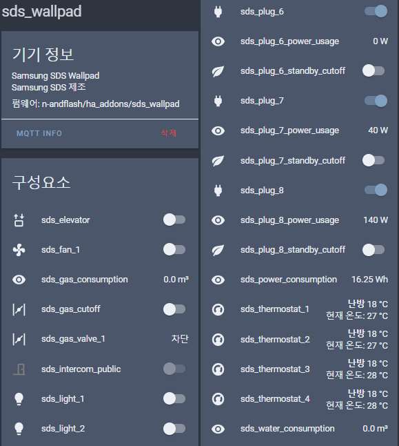

# 삼성SDS 월패드 RS485 Add-on (엘리베이터 호출 지원)

![Supports aarch64 Architecture][aarch64-shield] ![Supports amd64 Architecture][amd64-shield] ![Supports armhf Architecture][armhf-shield] ![Supports armv7 Architecture][armv7-shield] ![Supports i386 Architecture][i386-shield]

* [소개](#소개)
    + [지원 장치](#지원-장치)
* [설치](#설치)
    + [1. 준비 사항](#1-준비-사항)
    + [2. 애드온 설치, 실행](#2-애드온-설치-실행)
    + [3. MQTT 통합 구성요소 설정](#3-mqtt-통합-구성요소-설정)
    + [4. Lovelace 구성 예제](#4-lovelace-구성-예제)
* [설정](#설정)
* [지원](#지원)

## 소개

* [버전별 변경 사항](CHANGELOG.md)

* 삼성SDS 월패드를 사용하는 집에서, RS485를 이용해 여러 장치들을 제어할 수 있는 애드온입니다.
* 현관 스위치를 대신하여 엘리베이터를 호출하는 기능이 있습니다.
* MQTT discovery를 이용, 장치별로 yaml 파일을 직접 작성하지 않아도 집에 있는 모든 장치가 HA에 자동으로 추가됩니다.

### 지원 장치

#### 기본 연결
* 해당 장치가 월패드와 연결되어 있는 경우에 사용 가능합니다.
* 지원 기능
    * 전등
    * 난방
    * 환기 (전열교환기)
    * 대기전력차단, 콘센트별 실시간 전력사용량
    * 가스밸브 (상태 확인)
    * 실시간 에너지 사용량 (전기, 가스, 수도)

#### 현관 스위치 대체 시 추가 연결
* 동작 조건
    * **EW11 (소켓 통신) 사용 시 지원 불가**
    * **기존 현관 스위치의 RS485 연결을 분리 필요**
    * Configuration에서 entrance\_mode를 "full" 로 변경
        * 디스플레이가 달린 신형 현관스위치인 경우 "full" 대신 "new" 로 변경
* 지원 기능
    * 엘리베이터 호출
    * 가스밸브 잠금

#### 인터폰 추가 시 추가 연결
* 동작 조건
    * **EW11 (소켓 통신) 사용 시 지원 불가**
    * Configuration에서 intercom\_mode를 "on" 으로 변경
* 지원 기능
    * 공동현관 출입문 열림 (초인종이 울린 상태에서만 가능)
    * 현관 출입문 열림

## 설치

* 환경 구성에 지식이 있다면 애드온이 아닌 standalone으로도 사용하실 수 있도록 준비해 두었습니다.
    * 이 경우 run\_standalone.sh 를 한번 실행해서 options\_standalone.json 을 생성한 뒤, 적절히 수정하고 다시 run\_standalone.sh 를 실행하시면 됩니다.

### 1. 준비 사항

* Mosquitto broker 설치
    1. 홈어시스턴트의 Supervisor --> Add-on store에서 Mosquitto broker 선택합니다.
    2. INSTALL 후 START 합니다.
* MQTT Integration 설치
    1. 홈어시스턴트의 설정 --> 통합 구성요소에서 우하단 추가( + ) 를 누른 후 MQTT를 검색하여 선택합니다.
    2. "브로커" 에 HA의 IP주소 입력, "기기 검색 활성화" 후 확인을 누릅니다.

### 2. 애드온 설치, 실행

1. 홈어시스턴트의 Supervisor --> Add-on store에서 우상단 메뉴( ⋮ ) 를 누른 후 "repositories" 선택합니다.
2. "Add repository" 영역에 아래 주소 중 한 개를 입력 후 ADD 를 누릅니다.
    1. 애드온 개발자 개인 저장소: https://github.com/n-andflash/ha_addons
    2. 홈어시스턴트 카페 통합 저장소: https://github.com/HAKorea/addons
3. 하단에 나타난 "Samsung SDS RS485 Addon with Elevator Call" 을 선택합니다.
4. "INSTALL" 버튼을 누른 후 "START" 가 나타날 때까지 기다립니다. (수 분 이상 걸릴 수 있습니다)
    1. 설치 중 오류가 발생하면 Supervisor -> System 의 System log 최하단을 확인해봐야 합니다.
5. "START" 가 보이면, 시작하기 전에 "Configuration" 페이지에서 아래 설정을 구성 후 "SAVE" 를 누릅니다.
    1. serial\_mode (EW11 사용시 socket, 그 외의 경우 serial)
    2. serial/port 혹은 socket/address
    3. mqtt/server: 위의 "브로커"와 같은 주소 입력
6. "Info" 페이지로 돌아와서 "START" 로 시작합니다.
    1. 첫 시작 시 회전 애니메이션이 사라질 때까지 기다려주세요.
7. "Log" 페이지에서 정상 동작하는지 확인합니다.

### 3. MQTT 통합 구성요소 설정

* MQTT discovery를 지원하므로, yaml 파일을 장치마다 일일이 설정할 필요가 없습니다.
    * 통합 구성요소 페이지에 MQTT가 있고, [ ⋮ ] 를 클릭했을 때 "새로 추가된 구성요소를 활성화" 되어 있어야 합니다.
* MQTT 통합 구성요소에 "sds\_wallpad" 기기가 생성되고 모든 엔티티가 등록됩니다.

### 4. Lovelace 구성 예제

* [설정 방법 보러가기](DOCS_LOVELACE.md)
* 월패드에 연결되지 않은 기능은 사용하실 수 없습니다.

## 설정

### mode:
#### `serial_mode` (serial / socket)
* serial: USB to RS485 혹은 TTL to RS485를 이용하는 경우
* socket: EW11을 이용하는 경우

#### `entrance_mode` (off / minimal / full)
* full: 현관 스위치가 없거나 연결을 끊은 경우, 이 애드온이 완전한 현관 스위치로 동작합니다.
* new: 디스플레이가 달린 신형 현관스위치인 경우 full 대신 new로 설정해야 할 수 있습니다.
* minimal: 현관 스위치가 있는 상황에서, 엘리베이터 호출이 필요한 경우만 강제로 끼워넣습니다 (nodejs 애드온과 거의 같은 방식). 성공률이 매우 낮아서 수십 초 이상 걸리는 경우도 있습니다. max\_retry를 적절히 설정하세요.
    * 신형 현관스위치 지원하지 않음
* off: 현관 스위치 관련 기능을 비활성화 합니다. 일반적인 월패드 애드온으로만 동작합니다.

#### wallpad\_mode (on / off)
* on: 일반적인 월패드 애드온 기능
* off: 기존 애드온과 함께 쓰고 싶을 때. 이게 정상동작하는지 아직 테스트되지 않음

#### `intercom_mode` (on / off)
* on: 가상의 인터폰을 추가합니다. 현관문을 열거나, 공동현관 초인종이 울렸을때 공동현관을 열 수 있습니다.
* off: 인터폰 추가 기능을 비활성화합니다.

### serial: (serial\_mode 가 serial 인 경우)

#### `port`
* Supervisor -> System -> HARDWARE 버튼을 눌러 serial에 적혀있는 장치 이름을 확인해서 적어주세요.
* USB to RS485를 쓰신다면 /dev/ttyUSB0, TTL to RS485를 쓰신다면 /dev/ttyAMA0 일 가능성이 높습니다.
* 단, 윈도우 환경이면 COM6 과 같은 형태의 이름을 가지고 있습니다.

#### baudrate, bytesize, parity, stopbits (기본값 9600, 8, E, 1)
* 기본값으로 두시면 됩니다.
* 사용 가능한 parity: E, O, N, M, S (Even, Odd, None, Mark, Space)

### socket: (serial\_mode 가 socket 인 경우)

#### `address`
* EW11의 IP를 적어주세요.

#### port (기본값: 8899)
* EW11의 포트 번호를 변경하셨다면 변경한 포트 번호를 적어주세요.

### MQTT:

#### `server`
* MQTT broker (Mosquitto)의 IP를 적어주세요. 일반적으로 HA가 돌고있는 서버의 IP와 같습니다.

#### port (기본값: 1883)
* Mosquitto의 포트 번호를 변경하셨다면 변경한 포트 번호를 적어주세요.

#### `need_login`
* Mosquitto에 login이 필요하도록 설정하셨으면 (anonymous: false) true로 수정해 주세요.

#### user, passwd
* need\_login이 true인 경우 Mosquitto의 아이디와 비밀번호를 적어주세요.

#### discovery (true / false)
* false로 변경하면 HA에 장치를 자동으로 등록하지 않습니다. 필요한 경우만 변경하세요.

#### prefix (기본값: sds)
* MQTT topic의 시작 단어를 변경합니다. 기본값으로 두시면 됩니다.

### rs485:
#### max\_retry (기본값: 20)
* 실행한 명령에 대한 성공 응답을 받지 못했을 때, 몇 초 동안 재시도할지 설정합니다. 특히 "minimal" 모드인 경우 큰 값이 필요하지만, 예상치 못한 타이밍에 동작하는 상황을 막으려면 적절한 값을 설정하세요.

#### early\_response (기본값: 2)
* 현관 스위치로써 월패드에게 응답하는 타이밍을 조절합니다. 0~2. 특히 "minimal" 모드의 성공률에 약간 영향이 있습니다 (큰 기대는 하지 마세요).

#### dump\_time (기본값: 0)
* 0보다 큰 값을 설정하면, 애드온이 시작하기 전에 입력한 시간(초) 동안 log로 RS485 패킷 덤프를 출력합니다.
* SerialPortMon으로 RS485를 관찰하는 것과 같은 기능입니다.
* 버그/수정 제보 등 패킷 덤프가 필요할 때만 사용하세요.

#### intercom\_header (기본값: A45A)
* 평상시 RS485 덤프에서 A15A, A25A, A35A, A45A, A55A, A65A 중 한 가지가 보여야 intercom\_mode 를 사용할 수 있습니다.
* 보이는 패킷을 입력해 주세요.

### log:
#### to\_file (true / false)
* false로 설정하면 로그를 파일로 남기지 않습니다.
* 로그는 매일 자정에 새 파일로 저장되며, 기존 로그는 파일명에 날짜를 붙여 7개까지 보관됩니다.

#### filename (기본값: /share/sds\_wallpad.log)
* 로그를 남길 경로와 파일 이름을 지정합니다.

## 지원

* 정확한 지원을 위해서, 글을 쓰실 때 아래 사항들을 포함해 주세요.
    * 실행 로그 (HA의 share 폴더에 최신 로그 파일 (날짜가 써있지 않은 sds\_wallpad.log 파일) 이 있습니다)
    * Configuration 페이지 내용 (MQTT broker password가 있으면 가려주세요)
* 집마다 패킷이나 장치 구성이 다르므로, 해결을 위해 여러 번의 추가정보 확인 요청이 필요할 수 있습니다.

[HomeAssistant 네이버 카페 (질문, 수정 제안 등)](https://cafe.naver.com/koreassistant)

[Github issue 페이지 (버그 신고, 수정 제안 등)](https://github.com/n-andflash/ha_addons/issues)

[삼성SDS 월패드 RS485 패킷 분석](DOCS_PACKETS.md)

## 면책조항 (Disclaimer)

* 이 애드온은 무상으로 제공되므로 정확성이나 안정성 등 어떠한 보증도 제공하지 않습니다.
* 이 애드온은 오픈소스로 실행 코드와 함께 배포되므로 코드 및 동작에 대한 확인 책임은 사용자에게 있습니다.
* 기타 사항은 GPLv3를 따릅니다. [전문보기](LICENSE)

---

* 카카오톡 기부 코드: https://qr.kakaopay.com/281006011000008548744237 (모바일에서만 가능)

[aarch64-shield]: https://img.shields.io/badge/aarch64-yes-green.svg
[amd64-shield]: https://img.shields.io/badge/amd64-yes-green.svg
[armhf-shield]: https://img.shields.io/badge/armhf-yes-green.svg
[armv7-shield]: https://img.shields.io/badge/armv7-yes-green.svg
[i386-shield]: https://img.shields.io/badge/i386-yes-green.svg
